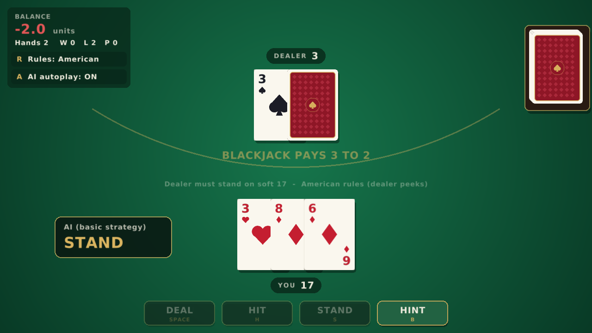
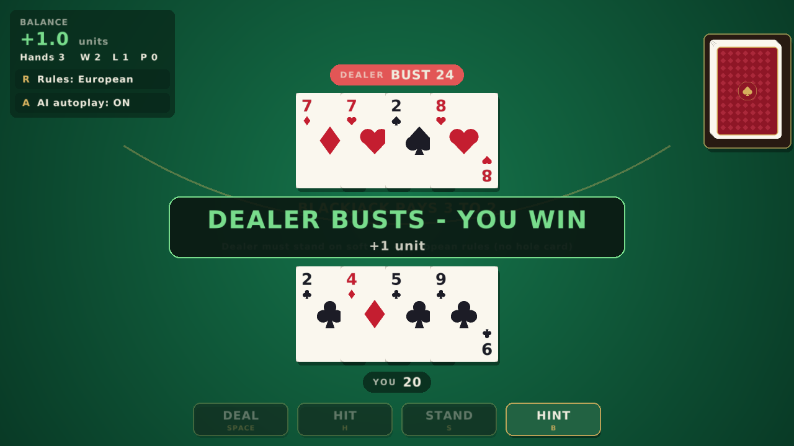

# Blackjack AI Lab

A C++20 Blackjack engine used as a test bed for decision-making agents:
a random baseline, textbook basic strategy, online Monte Carlo search and
tabular Q-Learning. You can also play against the dealer yourself, in the
console or in an animated window built with raylib.

<p align="center">
  
  
</p>

```
Agent                       Win     Loss     Push    EV/hand  95% CI      hands/s
------------------------------------------------------------------------------------
Random                   31.90%   63.96%    4.14%    -29.78%  +/- 0.19%     3600000
Basic strategy           43.36%   47.96%    8.68%     -2.35%  +/- 0.19%     4500000
Monte Carlo              43.02%   48.40%    8.57%     -3.08%  +/- 0.61%       25000
Q-Learning (greedy)      43.31%   47.96%    8.73%     -2.41%  +/- 0.19%     4300000

Q-Learning trained for 2000000 rounds; its policy matches basic strategy in 98.8% of decisions.
```
<sub>`blackjack --seed 2026`: 6 decks, dealer stands on soft 17, hit/stand only.
1M evaluation hands per agent (100k for Monte Carlo). Single thread, GCC -O3.</sub>

## Build and run

Requirements: CMake 3.20+ and a C++20 compiler (MSVC 2022, GCC 11+ or Clang 14+).
The engine, the console game and the tests have no external dependencies.

```bash
cmake -S . -B build
cmake --build build --config Release
ctest --test-dir build -C Release --output-on-failure

./build/blackjack                  # run the AI lab (Windows: build\Release\blackjack.exe)
./build/blackjack --play           # play yourself (European rules), type ? for a hint
./build/blackjack --play --peek    # play with American rules (dealer peeks)
./build/blackjack --seed 42        # reproducible run
./build/blackjack --help           # all options (decks, H17, peek rule, rounds...)
```

### Graphical version

Optional, needs CMake 3.25+. raylib 5.5 is downloaded and built automatically
(or an installed raylib is used if CMake can find one).

```bash
cmake -S . -B build -DBLACKJACK_BUILD_GUI=ON
cmake --build build --config Release --target blackjack_gui
./build/blackjack_gui              # Windows: build\Release\blackjack_gui.exe
```

| Key | Action |
|---|---|
| `Space` / `Enter` | Deal |
| `H` / `S` | Hit / Stand |
| `B` | Show the basic strategy hint |
| `R` | Switch European / American rules (between hands) |
| `A` | AI autoplay: watch the basic strategy agent play |

Everything is clickable as well. `--seed N` and `--peek` work like in the console version.

## Architecture

```text
include/ src/
├── blackjack/          Game engine (no console I/O)
│   ├── Card            value type, constexpr
│   ├── Deck            multi-deck shoe, seeded std::mt19937, cut card
│   ├── Hand            hard/soft totals
│   ├── BlackjackGame   round flow, dealer rules, payouts
│   └── RoundObserver   hooks for any front end
├── agents/             All players implement Agent::chooseAction(State)
│   ├── RandomAgent
│   ├── BasicStrategyAgent
│   ├── MonteCarloAgent
│   ├── QLearningAgent
│   └── HumanAgent      the human plays through the same interface
└── ui/
    └── ConsoleRenderer a RoundObserver that prints the table
gui/                    raylib front end (optional target)
├── CardAtlas           procedurally drawn cards baked into one texture
├── TableView           a RoundObserver that animates events
└── main.cpp            input, layout, HUD
tests/                  unit tests (CTest), no framework needed
```

`blackjack_core` is a static library; the console program, the GUI and every
test link against it.

## Design notes

- **Game logic knows nothing about the screen.** `BlackjackGame` reports events
  through an optional `RoundObserver`. The console renderer is one observer and
  the raylib `TableView` is another. When nobody observes (training), the cost
  is a null-pointer check.
- **One rules engine, blocking or step by step.** The game is a small state
  machine (`beginRound()` / `act()` / `getResult()`). The real-time GUI calls
  one step per click and never blocks the frame loop. `playRound(agent)`, used
  by the simulations, is just a loop over the same API, and a test checks that
  both paths give identical results. Reusing each round's hand buffers instead
  of building new ones raised simulation speed from ~3.5M to ~4.5M hands/s.
- **Instant logic, animated presentation.** A dealer turn is resolved in
  microseconds; `TableView` records the events into a queue and plays them back
  over time (deal, flip the hole card, draw), so the rules code never knows
  about frames or tweens. Card movement uses frame-rate independent
  exponential smoothing, and flips squash the card quad to zero width and swap
  the texture.
- **No art assets.** Card faces and backs are drawn from basic shapes at
  startup, at 2× resolution, into a single mip-mapped texture atlas. Drawing a
  card is then one textured quad.
- **The human is just another agent.** `HumanAgent` reads from an injected
  `std::istream`, so the interactive path is unit-tested with string streams.
- **Reproducible by default.** Every random source takes a seed and the lab
  prints the one it used. `Deck::stacked()` builds fixed card orders, so game
  rules are tested against exact scenarios (3:2 blackjack payout,
  dealer peek, soft 17 rule, busting, pushes).
- **Q-table as a flat array.** The state space is player sum × dealer up card ×
  soft/hard, so the table is a `std::array` indexed directly by the state:
  no hashing, no allocations, and ~18 KB including visit counters (fits in L1).
  Training runs at ~4M hands/s on one core.
- **Learning rate 1/N(s,a) with a floor.** Each Q-value starts as a running
  average (fast, unbiased early estimates) and then keeps a small constant
  rate. With a constant 0.005 rate the agent matched basic strategy in ~95% of
  decisions; with this schedule it reaches ~98–99%. The remaining differences
  are cells like hard 12 vs 4 or 16 vs 10, where Hit and Stand differ by
  less than 0.2% of a bet. That is too small to tell apart with this much training.
- **Monte Carlo with common random numbers.** For each simulation, Hit and Stand
  are evaluated against the *same* dealer card sequence, which removes most of
  the variance from the comparison. Card streams use SplitMix64 because
  reseeding it is free (a `std::mt19937` carries 2.5 KB of state). The hole card
  is sampled consistently with the table rules (no dealer blackjack once the
  dealer has peeked).
- **Statistics you can trust.** Results report the expected value per hand with a
  95% confidence interval (Welford's online variance), not just a win rate.
  Win rate alone hides pushes and the 3:2 blackjack payout.
- **American and European rules.** With `--peek` the dealer checks the hole
  card for blackjack before the player acts. With `--no-peek` (European
  "no hole card", the default when you play) the dealer's second card comes after
  the player has finished, and a dealer blackjack beats any 21 made with three or more
  cards. With hit/stand only, both rules have the same expected value: against
  a dealer blackjack every decision loses one bet. The tests check that (and
  the lab agrees: −2.35% vs −2.38% for basic strategy, within the CI).
- **Tests run in Release too.** A tiny `CHECK` macro replaces `assert`, which
  is compiled out under `NDEBUG`.
- **CI** builds on GCC, Clang (with `-Werror -Wconversion -Wshadow`) and MSVC,
  plus an AddressSanitizer/UBSan job. The GUI code also compiles cleanly with
  the same warnings (raylib's headers are marked as system headers).

## Limitations and next steps

- Only Hit and Stand. Double down, split and surrender are the next step
  (basic strategy with them brings the house edge to ~0.5%).
- The Monte Carlo agent assumes an infinite deck. Feeding it the real shoe
  composition would enable card-counting experiments.
- Training is single-threaded. Running independent environments per thread
  and merging Q-tables is a natural extension.
